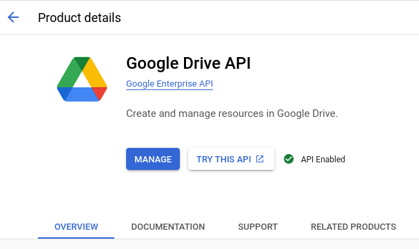

[PyDrive](https://pythonhosted.org/PyDrive/)

# PyDrive
0. Make sure you have `PyDrive` installed.
    ```bash
    pip install pydrive
    ```
1. Go to https://console.cloud.google.com and set up a project. (Name and other details don't really matter.)
2. Go to https://console.cloud.google.com/apis/dashboard and make sure the Google Drive API is enabled.
    - Select "Enable APIs and Services" and type "Google Drive" in the search bar. Select "Google Drive API" and enable it.
    - 
    - 
3. Go to https://console.cloud.google.com/apis/credentials
    - Make sure you are on your current project.
    - Select "Create Credentials" >> "OAuth client ID"
    - Select "Desktop app" and give it a name (Name shouldn't matter that much.)
    - 
4. Download the json file and rename it `client_secrets.json`. Place the json `client_secrets.json` file in the home directory of your project.
5. Create a `settings.yaml` file similar to [settings.yaml](settings.yaml). Fill in your `client_id` and `client_secret` from the `client_secrets.json` file.
    ```yaml
    client_config_backend: settings
    client_config:
    client_id: insert-client-id-here
    client_secret: insert-client-secret-here

    save_credentials: True
    save_credentials_backend: file
    save_credentials_file: credentials.json

    get_refresh_token: True

    oauth_scope:
    - https://www.googleapis.com/auth/drive.file
    - https://www.googleapis.com/auth/drive.install 
    ```
6. Run the following lines to complete authentication (Feel free to create a new file.)
    ```python
    from pydrive.auth import GoogleAuth
    from pydrive.drive import GoogleDrive

    gauth = GoogleAuth()
    gauth.LocalWebserverAuth()
    drive = GoogleDrive(gauth)
    ```
    - Run the code. It will redirect you to a browser site to log in to your Google account. Select the account associated with the project.
7. This will create a `credentials.json` file, so that PyDrive will automatically work in the future and no longer ask to verify again in the future.


## Remote SSH
- Step 5 may not work properly if done in SSH. In order to make this work for SSH, do everything first on a local machine, then just copy over the `client_secrets.json`, `settings.yaml`, and `credentials.json` to your remote SSH server.